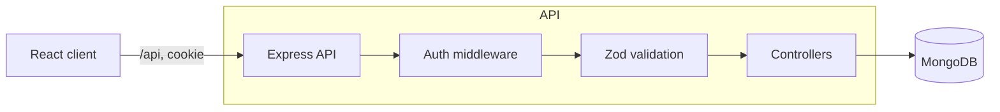

# TaskFlow

A full-stack task manager built with the MERN stack. Users register, log in, and manage their own tasks, and the API guarantees that nobody can read or change anyone else's.

**Live demo:** _add your Vercel URL here_ (demo login: `demo@taskflow.dev` / `Demo1234!`)

_Add a screenshot or short GIF here. Recruiters look at this first._

## Features

- Register, log in and log out, with sessions that survive a page refresh
- Create, edit and delete tasks with a title, notes, status, priority and due date
- Click a task's status ring to move it from to do to in progress to done
- Filter by status, search titles and notes, sort by newest, oldest or due soonest
- Pagination, with filters kept in the URL so views can be refreshed or shared
- Loading, empty and error states, inline form validation, keyboard-accessible dialog
- 21 automated API tests and a CI pipeline

## Tech stack

| Layer | Tools |
|---|---|
| Frontend | React 18, React Router 6, Vite, plain CSS |
| Backend | Node.js, Express 4, Zod validation |
| Database | MongoDB with Mongoose |
| Auth | bcrypt password hashing, JWT in an httpOnly cookie |
| Security | Helmet, CORS allow-list, rate limiting on auth routes |
| Tests / CI | Jest, Supertest, mongodb-memory-server, GitHub Actions |

## Architecture



Every request to `/api/tasks` passes through `requireAuth`, which verifies the JWT and loads the user. Controllers then scope every query by `user`.

```
taskflow/
├── client/src/
│   ├── api/          fetch wrapper with typed ApiError
│   ├── context/      AuthContext, ToastContext
│   ├── components/   TaskItem, TaskModal, Pagination, route guards
│   └── pages/        AuthPage, TasksPage
└── server/
    ├── src/
    │   ├── controllers/  auth, tasks
    │   ├── middleware/   requireAuth, validate, errorHandler
    │   ├── models/       User, Task
    │   ├── routes/
    │   └── validators/   Zod schemas
    └── tests/            auth + tasks integration tests
```

## API

All task routes require a session. Errors use one shape: `{ "error": { "message": "...", "details": { "field": "..." } } }`.

| Method | Route | Purpose |
|---|---|---|
| POST | `/api/auth/register` | Create account and start a session |
| POST | `/api/auth/login` | Log in |
| POST | `/api/auth/logout` | End the session |
| GET | `/api/auth/me` | Current user |
| GET | `/api/tasks` | List tasks. Query: `status`, `priority`, `search`, `sort` (`newest`, `oldest`, `due`), `page`, `limit` |
| GET | `/api/tasks/stats` | Task counts per status |
| POST | `/api/tasks` | Create a task |
| PATCH | `/api/tasks/:id` | Update any subset of fields |
| DELETE | `/api/tasks/:id` | Delete a task |
| GET | `/api/health` | Health check |

## Design decisions

- **httpOnly cookie instead of localStorage.** JavaScript can't read the token, so an XSS bug can't steal it. The cookie is `SameSite=Lax` and `Secure` in production.
- **Same-origin API calls.** The client always calls `/api`. Vite proxies it in development and a Vercel rewrite forwards it in production, so the cookie stays first-party. That avoids the third-party cookie blocking browsers apply to a frontend and API on different domains.
- **Ownership is enforced in the query.** Updates and deletes use `findOneAndUpdate({ _id, user })`, so someone else's task returns 404, the same as a missing one, and its existence isn't revealed. A test covers this.
- **Login doesn't reveal which emails exist.** Wrong password and unknown email return the same error, and a dummy hash is compared for unknown emails so response times match.
- **Validation at the edge.** Zod schemas trim, coerce and reject input before controllers run, and return field-level errors the form displays.
- **Search input is escaped**, so users can't run regular expressions against the database.
- **Bounded input.** JSON bodies are capped at 10 KB, page size at 50, and passwords at 72 characters (bcrypt's limit).

## Run locally

Requirements: Node 18+ and a MongoDB instance (local or [Atlas](https://www.mongodb.com/atlas)).

```bash
npm run install:all
cp server/.env.example server/.env    # then set MONGO_URI and JWT_SECRET
npm run seed                          # optional: demo user with sample tasks
npm run dev                           # API on :5000, client on :5173
```

## Tests

```bash
npm test
```

The suite starts an in-memory MongoDB, which is downloaded on first run. If your network blocks that, point the tests at any running MongoDB instead:

```bash
TEST_MONGO_URI=mongodb://127.0.0.1:27017/taskflow_test npm test --prefix server
```

The tests cover registration and login, session handling, validation, CRUD, ownership isolation between users, filtering, search, pagination and sorting.

## Deploy

1. **Database:** create a free MongoDB Atlas cluster, add a database user, allow network access, and copy the connection string.
2. **API on Render** (or Railway): root directory `server`, build command `npm install`, start command `npm start`. Set `NODE_ENV=production`, `MONGO_URI`, `JWT_SECRET` (32+ random characters) and `CLIENT_URL` (your Vercel URL). Free instances sleep when idle, so the first request after a pause can be slow.
3. **Client on Vercel:** root directory `client`. In `client/vercel.json`, replace `YOUR-API-NAME.onrender.com` with your Render hostname.
4. Run `npm run seed` once against the production database if you want the demo account.

## Possible next steps

Refresh-token rotation, password reset by email, task labels, drag-and-drop ordering, and end-to-end tests with Playwright.
